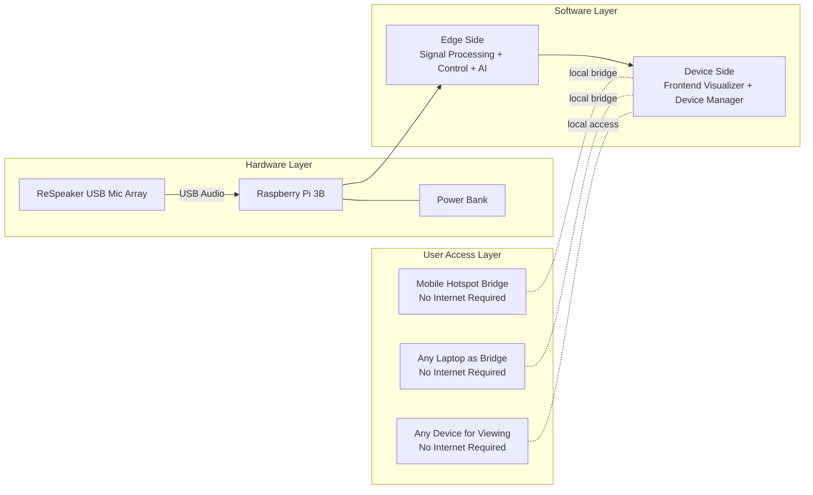
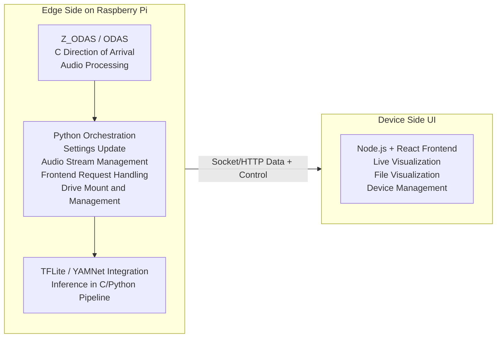

# SonicWild Spatially Aware Acoustics

## High-Level Architecture

This document reformats the high-level architecture into a professional, implementation-oriented view.

### 1) System Line Diagram (Hardware + Software Placement)

### 2) Software Responsibility Split (Edge Side vs Device Side)

## Section Explanations

### Hardware Layer
- ReSpeaker USB Mic Array captures multichannel audio.
- Raspberry Pi 3B is the edge compute node.
- Power Bank provides portable, field-ready power.

### Edge Side Software
- Z_ODAS / ODAS performs localization and core audio direction processing.
- Python services orchestrate runtime settings, manage audio stream flow, and bridge requests from UI/control clients.
- TFLite and YAMNet components are used for embedded acoustic event inference and ongoing model integration.

### Device Side Software
- Node.js + React frontend is used for visualization and device control.
- Supports live and recorded views and configuration workflows.

### Connectivity and Access
- Architecture supports local/offline operation through hotspot/laptop bridging.
- Viewer devices can access the system without requiring public internet.

## Repository Mapping

### Core Edge Repositories
- SonicWild_RPi_Setup: Raspberry Pi setup, deployment baseline, and system-level scripts.
- SonicWild_ODAS_Edge: edge ODAS/audio processing implementation.

### Ongoing Work and Research
- SonicWild_Yammnet: YAMNet experimentation and integration work.
- SonicWild_Simulator: simulation and analysis workflows.

## Notes
- This representation is derived from the current high-level architecture slide and your repo context.
- As implementation evolves, expand this doc with interface contracts, message schemas, and deployment topology.