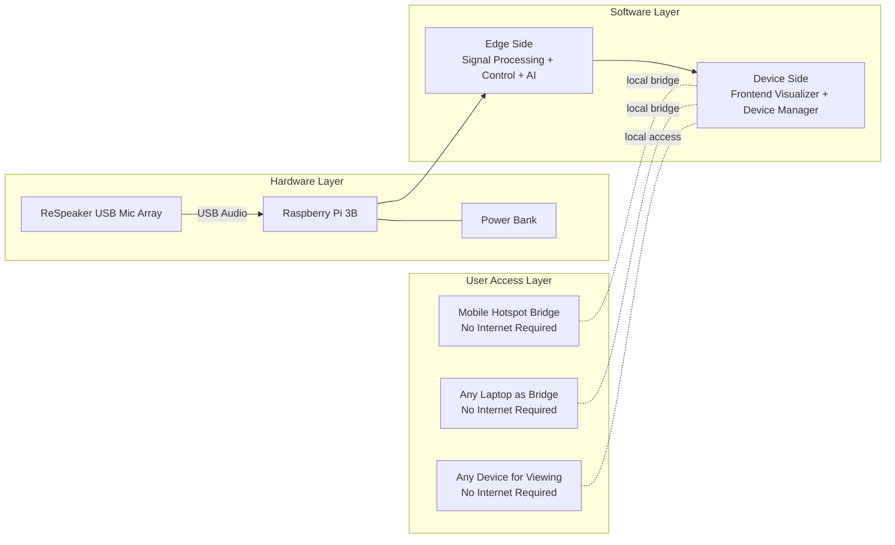
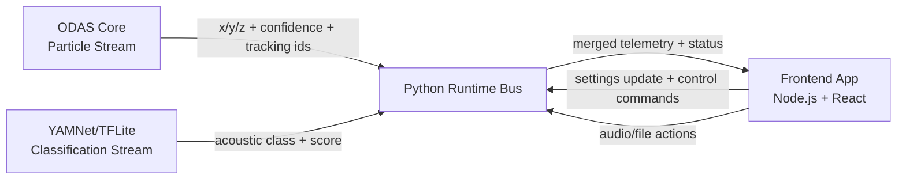

# SonicWild Spatially Aware Acoustics

## High-Level Architecture

This document reformats the high-level architecture into a professional, implementation-oriented view.

### 1) System Line Diagram (Hardware + Software Placement)



### 2) Software Responsibility Split (Edge Side vs Device Side)

```mermaid
flowchart LR
    subgraph EDGE_SIDE[Edge Side on Raspberry Pi]
        subgraph ZODAS[Z_ODAS Processing Zone (~30% of Edge Software Area)]
            ODAS_CORE[ODAS Core in C\nDirection of Arrival\nParticle/Localization Stream]
            YAMNET_BOX[YAMNet/TFLite Module\n(~10% sub-area inside Z_ODAS)]
            ODAS_CORE <--> YAMNET_BOX
        end

        PY[Python Control and Streaming Layer\nSettings Update\nAudio Stream Management\nFrontend Request Handling\nDrive Mount and Management]

        ZODAS <--> PY
    end

    subgraph DEVICE_SIDE[Device Side UI]
        FE[Node.js + React Frontend\nLive Visualization\nFile Visualization\nDevice Management]
    end

    EDGE_SIDE -->|Particle Data: timestamp, id, type, x/y/z, confidence| DEVICE_SIDE
    DEVICE_SIDE -->|Control Messages + Audio Requests + Data Messages| EDGE_SIDE

    classDef edge fill:#ffe9b3,stroke:#c27c00,stroke-width:2px,color:#1f1f1f;
    classDef odas fill:#ffd166,stroke:#9a6700,stroke-width:3px,color:#111111;
    classDef ai fill:#ff8fab,stroke:#a4133c,stroke-width:2px,color:#111111;
    classDef py fill:#8ecae6,stroke:#005f73,stroke-width:2px,color:#111111;
    classDef device fill:#bde0fe,stroke:#1d3557,stroke-width:2px,color:#111111;

    class EDGE_SIDE edge;
    class ZODAS,ODAS_CORE odas;
    class YAMNET_BOX ai;
    class PY py;
    class DEVICE_SIDE,FE device;
```

### 3) Interface Message View (Who Sends What)



## Repository Links By Section

### Edge Processing (ODAS)
- Repository: [SonicWild_ODAS_Edge](https://github.com/anamtya-tech/SonicWild_ODAS_Edge)
- README: [SonicWild_ODAS_Edge README](https://github.com/anamtya-tech/SonicWild_ODAS_Edge/blob/main/README.md)

### Raspberry Pi Setup and System Bring-Up
- Repository: [SonicWild_RPi_Setup](https://github.com/anamtya-tech/SonicWild_RPi_Setup)
- Documentation Entry: [SonicWild_RPi_Setup Architecture Notes](https://github.com/anamtya-tech/SonicWild_RPi_Setup/blob/main/PI_TECH_STACK_ARCHITECTURE.md)

### Frontend and Visualization Context
- Current architecture workspace: [SonicWild_SpatialyAwareAcoustics](https://github.com/anamtya-tech/SonicWild_SpatialyAwareAcoustics)
- Source slide used for this rewrite: [blue print/Sonicwild Block Diagram.pptx](https://github.com/anamtya-tech/SonicWild_SpatialyAwareAcoustics/blob/main/blue%20print/Sonicwild%20Block%20Diagram.pptx)

## Section Explanations

### Hardware Layer
- ReSpeaker USB Mic Array captures multichannel audio.
- Raspberry Pi 3B is the edge compute node.
- Power Bank provides portable, field-ready power.

### Edge Side Software
- Z_ODAS / ODAS performs localization and core audio direction processing.
- Python services orchestrate runtime settings, manage audio stream flow, and bridge requests from UI/control clients.
- TFLite and YAMNet components are used for embedded acoustic event inference and ongoing model integration.

### Device Side Software
- Node.js + React frontend is used for visualization and device control.
- Supports live and recorded views and configuration workflows.

### Connectivity and Access
- Architecture supports local/offline operation through hotspot/laptop bridging.
- Viewer devices can access the system without requiring public internet.

## Repository Mapping

### Core Edge Repositories
- SonicWild_RPi_Setup: Raspberry Pi setup, deployment baseline, and system-level scripts.
- SonicWild_ODAS_Edge: edge ODAS/audio processing implementation.

### Ongoing Work and Research
- SonicWild_Yammnet: YAMNet experimentation and integration work.
- SonicWild_Simulator: simulation and analysis workflows.

## Notes
- This representation is derived from the current high-level architecture slide and your repo context.
- As implementation evolves, expand this doc with interface contracts, message schemas, and deployment topology.